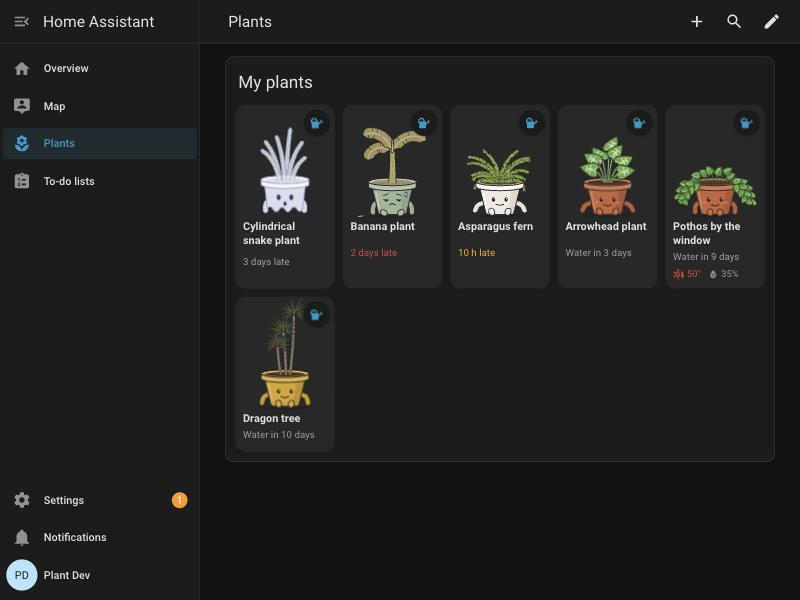
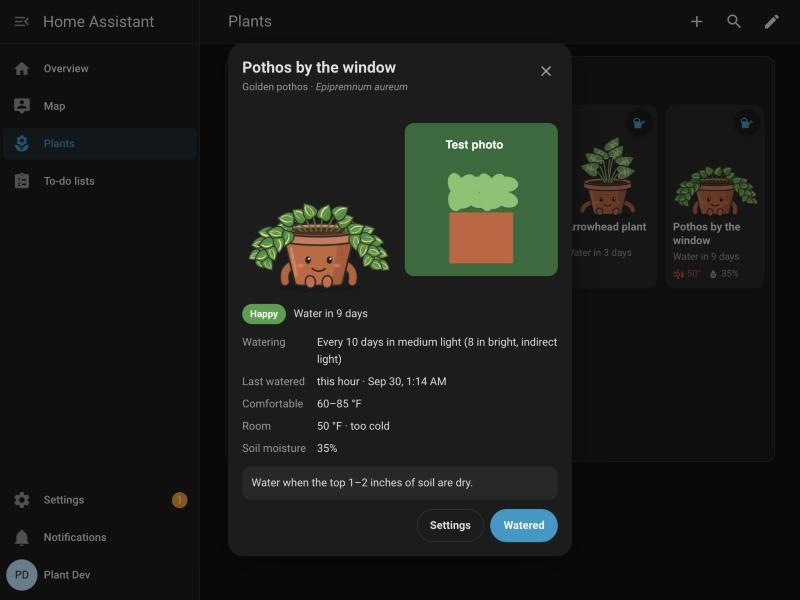

# Lil Wet Guys

A plant tracker for Home Assistant.

Keeps a watering countdown for each of your houseplants and shows them on your
dashboard as cartoons in their own pots, most thirsty first. When a plant's
watering date passes it slowly droops, browns and frowns; three days late it
turns into a ghost. Tap the watering can to bring it back.



## What you get

Each plant is its own device with these entities:

| Entity | What it does |
| --- | --- |
| `sensor.<plant>_next_watering` | When the plant is next due. Home Assistant shows it as a countdown. |
| `sensor.<plant>_status` | `happy`, `thirsty` (0–1½ days late), `wilting` (1½–3 days late) or `ghost` (3+ days late). Its attributes carry everything the card needs. |
| `button.<plant>_watered` | Press after watering; the countdown starts again. |
| `datetime.<plant>_last_watered` | When it was last watered. Change it if you watered yesterday and forgot to press the button. |
| `select.<plant>_light` | How much light the plant gets where it lives (see below). Changing it moves the next watering straight away. Also editable in the card's plant popup. |
| `text.<plant>_notes` | Free-text notes (up to 255 characters). Also editable in the card's plant popup. |
| `image.<plant>_photo` | The plant's photo, if you added one. |
| `binary_sensor.<plant>_temperature` | On when the room is too cold or hot for the plant (only if you linked a thermometer). Its `heat` attribute (also on the status sensor) is `sweating` when it's a little too hot and `scorching` when it's 5 °C (9 °F) or more over the plant's highest comfortable temperature. |

Plus a dashboard card and a daily reminder blueprint.

When a linked thermometer says the room is too hot, the plant's face shows it:
**sweating** (a little too warm: heavy eyes, a wobbly mouth, flushed cheeks and
sweat drops) or **scorching** (5 °C / 9 °F or more too hot: eyes squeezed shut,
panting, a red-hot pot and heat rising beside it).

## How the countdown works

Every plant has a watering interval for **bright, indirect light**. The light
where it actually lives stretches or shortens that:

| Light | Interval |
| --- | --- |
| Direct sun | ×0.75 |
| Bright, indirect light | ×1 |
| Medium light | ×1.25 |
| Low light | ×1.5 |

So a golden pothos (8 days in bright light) in medium light is due every 10
days. The next watering is the last watering plus that interval.

Moved a plant to a sunnier or darker spot? Change its **Light** in the card's
plant popup, or on its device page, and the countdown adjusts.

If you link a **soil moisture sensor**, a rise of 10 percentage points (you can
change this) within an hour counts as watering and resets the countdown.

## Requirements

- Home Assistant **2025.6** or newer (plants are config subentries, which the
  "Add plant" button relies on).
- No cloud or AI services. Everything runs locally.

## Install

The repository is private, and [HACS can only read public
repositories](https://www.hacs.xyz/docs/faq/private_repositories/). Two ways in:

**Through HACS (recommended).** Make the repository public for a few minutes, then
in HACS: ⋮ → **Custom repositories** → add
`https://github.com/m1ghtymaus/Lil-Wet-Guys` as an **Integration** → open
**Lil Wet Guys** → **Download** → restart Home Assistant. Make the repository
private again. HACS installs the latest release.

**By hand.** Download the latest release from the repository's **Releases** page,
copy its `custom_components/lil_wet_guys` folder into your Home Assistant config
directory, next to `configuration.yaml`, and restart. The result should be
`<config>/custom_components/lil_wet_guys/manifest.json`.

| Install type | Config directory | How to get files in |
| --- | --- | --- |
| Home Assistant OS / Supervised | `/config` (`/homeassistant` over Samba) | Samba share, Studio Code Server or File editor add-on, or `scp` via the SSH add-on |
| Container / Docker | whatever you mounted at `/config` | copy into that directory on the host |
| Core (venv) | `~/.homeassistant` | copy it there |

## Updating

Updates keep your plants. Their settings, last-watered times, notes and photos
are stored by Home Assistant outside the integration's folder, so replacing the
integration doesn't touch them.

1. Make a Home Assistant backup first (Settings → System → Backups). It's cheap
   insurance.
2. Make the repository public.
3. In HACS open **Lil Wet Guys** → ⋮ → **Update information**, then **Download**
   and pick the new version. Restart Home Assistant.
4. Make the repository private again, and refresh your browser so it loads the
   new card.

Installed by hand? Copy the new release's `lil_wet_guys` folder over the old one
and restart. What changed in each version is in [CHANGELOG.md](CHANGELOG.md).

## Settings

**Settings → Devices & services → Lil Wet Guys → Configure → Settings** has:

- **Temperature unit**: the same as Home Assistant, Celsius or Fahrenheit. It's
  used for every plant's comfortable temperatures, in the add and edit forms, on
  its entities and as the dashboard card's default.
- **Fertilizer reminders** (off by default): feed with Foliage Focus for two
  waterings in a row, then give one of plain water to rinse the soil. Each
  plant's popup on the dashboard says what its next watering should be and how
  much to mix in: 3 ml per litre for slow growers that burn easily (succulents,
  snake plants, peperomias), 5 ml for hungry aroids and alocasias, 4 ml for the
  rest. The moss terrarium is never fed. Every watering moves the cycle on,
  including ones spotted by a moisture sensor, and the card's Undo takes it back.
  If a plant gets out of step, change its **Next watering** setting on its
  device page.

## Moving plants to another Home Assistant

Settings → Devices & services → Lil Wet Guys → **Configure**:

- **Export all plants** saves every plant (settings, last-watered time, notes and
  photo) to a `.zip` and gives you a download link that works for an hour. A copy
  stays in `/config/lil_wet_guys/exports` (the five newest are kept).
- **Import plants from a file** adds the plants from an export. Choose whether to
  skip plants whose names you already use or add them anyway.

Linked thermometers and moisture sensors come across by entity id, so link them
again on the new instance if their ids differ.

## Set up

1. **Settings → Devices & services → Add integration → Lil Wet Guys.**
2. On the Lil Wet Guys page, press **Add plant**.
3. Give it a name and pick its type. The next page is filled in from the type:
   light, watering interval, comfortable temperatures. Change anything you like,
   pick a pot colour, add a photo, and set when you last watered it.
4. Under **Sensors (optional)** you can link a room thermometer and a soil
   moisture sensor.

To change a plant later, use the pencil next to it on the integration page
(**Edit plant**). Deleting it there removes its device and entities.

### Plant types with presets

- African Mask Plant (*Alocasia × amazonica 'Polly'*)
- Arrowhead Plant (*Syngonium podophyllum*)
- Asparagus Fern (*Asparagus densiflorus 'Sprengeri'*)
- Banana Plant (*Musa spp.*)
- Black Raven ZZ Plant (*Zamioculcas zamiifolia 'Raven'*)
- Cylindrical Snake Plant (*Dracaena angolensis*)
- Dragon Tail Plant (*Epipremnum pinnatum*)
- Dragon Tree (*Dracaena marginata*)
- Easter Cactus (*Schlumbergera gaertneri*)
- Elephant Ear (*Alocasia chienlii*)
- Golden Pothos (*Epipremnum aureum*)
- Green Velvet Alocasia (*Alocasia micholitziana 'Frydek'*)
- Heartleaf Philodendron (*Philodendron hederaceum*)
- Hope Peperomia (*Peperomia 'Hope'*)
- Inch Plant (*Tradescantia zebrina*)
- Jade Pothos (*Epipremnum aureum 'Jade'*)
- Lipstick Plant (*Aeschynanthus radicans*)
- Lucky Bamboo (*Dracaena sanderiana*)
- Mini Monstera (*Rhaphidophora tetrasperma*)
- Money Tree (*Pachira aquatica*)
- Monkey Mask (*Monstera adansonii*)
- Moss Terrarium (*Bryophyta*)
- Nerve Plant (*Fittonia albivenis*)
- Ox Tongue (*Gasteria spp.*)
- Persian Shield (*Strobilanthes dyerianus*)
- Pink Princess Philodendron (*Philodendron erubescens 'Pink Princess'*)
- Purple Passion Plant (*Gynura aurantiaca*)
- Radiator Plant (*Peperomia spp.*)
- Regal Shield (*Alocasia 'Regal Shield'*)
- Rubber Plant (*Ficus elastica 'Ruby'*)
- Satin Pothos (*Scindapsus pictus*)
- Snake Plant (*Dracaena trifasciata 'Laurentii'*)
- Snake Plant (*Dracaena trifasciata 'Moonshine'*)
- Snake Plant (*Dracaena trifasciata 'Zeylanica'*)
- Spider Plant (*Chlorophytum comosum*)
- Split-Leaf Philodendron (*Thaumatophyllum bipinnatifidum*)
- Swiss Cheese Plant (*Monstera deliciosa*)
- Thai Constellation Monstera (*Monstera deliciosa 'Thai Constellation'*)
- Tiger Aloe (*Gonialoe variegata*)
- Tiger Tooth Aloe (*Aloe juvenna*)
- Umbrella Plant (*Schefflera arboricola*)
- Variegated Baby Rubber Plant (*Peperomia obtusifolia 'Variegata'*)
- Variegated Million Hearts (*Dischidia ruscifolia 'Variegata'*)
- Weeping Fig (*Ficus benjamina*)
- White Bird of Paradise (*Strelitzia nicolai*)
- ZZ Plant (*Zamioculcas zamiifolia*)

Each has its own drawing and care preset (see
[`species.py`](custom_components/lil_wet_guys/species.py)). For anything else
choose **Other**, pick one of five drawings (leafy, trailing vine, succulent,
upright spiky, small tree) and fill in its care yourself.

## The dashboard card

The integration loads the card for you. Add it to a dashboard with:

```yaml
type: custom:lil-wet-guys-card
title: My plants   # optional
```

| Option | Default | What it does |
| --- | --- | --- |
| `title` | none | Heading above the plants. |
| `limbs` | `true` | Little arms and feet on each pot. |
| `background` | `none` | `bookshelf` stands the plants on a cartoon wooden bookshelf, with a few small surprises hidden around them. |
| `wood` | `walnut` | Bookshelf only: `walnut`, `oak`, `maple`, `cherry`, `mahogany`, `ebony`, `whitewash`, or `custom` with `wood_color`. |
| `wood_color` | none | With `wood: custom`, the colour (as `[r, g, b]`) the whole case is shaded from. |
| `whimsy` | `1` | Bookshelf only: surprises per plant, from `0` (just the shelves) to `4` (as many as fit). The card editor shows it as a slider. |
| `dividers` | `true` | Bookshelf only: wooden uprights splitting each row into equal compartments, every third plant when a row's plants divide by three, else every second when they divide by two. |
| `temperature_unit` | the integration's setting | `C` or `F` for the temperatures this card shows. Without it the card follows **Configure → Settings → Temperature unit**. |
| `entities` | all plants | A list of `sensor.<plant>_status` ids, to show only some plants. |

- New plants appear on their own, sorted by how soon they need water.
- The **watering can** marks a plant as watered, with **Undo** in the pop-up
  message.
- **Tap a plant** for its photo, care notes, room temperature and moisture, a
  **Watered** button, its **Light**, and your own **Notes**. You can change both
  right there. The light saves as soon as you pick one; notes save when you
  press **Save notes** (or Cmd/Ctrl+Enter) or close the popup.
- The **°C / °F** switch next to a plant's temperature range changes every
  temperature on the card. Each device remembers its own choice.
- With `background: bookshelf` each row of plants gets its own shelf, with
  names on little labels. Every time the page loads, a different handful of
  surprises turns up: books, a snail, a vine up the side, a toadstool cottage,
  a candle, a jar of jam, acorns and more, plus something magical every time
  (potions, crystals, a frog with fairy wings, mushroom folk…), and fireflies
  twinkle on every shelf.



## Reminders

[`blueprints/automation/lil_wet_guys/water_reminder.yaml`](blueprints/automation/lil_wet_guys/water_reminder.yaml)
sends one notification per plant that needs water, once a day at a time you
choose (9:00 by default), each with a **Watered** button. It can also warn when
a room is too cold or hot for a plant. It finds your plants itself, so new
plants need no changes.

To use it, copy the file to `<config>/blueprints/automation/lil_wet_guys/` (or
import it by URL once this repository is on GitHub), then **Settings →
Automations & scenes → Blueprints → Lil Wet Guys – water reminders → Create
automation** and pick your phone. Notifications need the Home Assistant
Companion app.

## Development

Releases: see [RELEASING.md](RELEASING.md).

```bash
uv venv --python 3.13 .venv
uv pip install --python .venv/bin/python pytest-homeassistant-custom-component
.venv/bin/python -m pytest
uvx ruff check .
```

- `custom_components/lil_wet_guys/frontend/art/` draws the plants;
  `preview/index.html` shows every drawing with a watering-day slider (serve the
  project folder over HTTP and open `/preview/`).
- After editing `strings.json`, run `python3 tools/build_translations.py` to
  regenerate `translations/en.json`.
- `dev/` (not committed) holds a throwaway local Home Assistant for trying the
  integration end to end; see `dev/README.md`.
